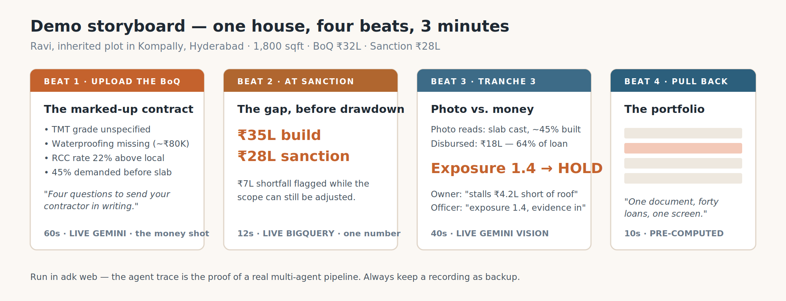

# Neev — Demo Plan

*Demo the story, not the feature list. One house, one owner, three minutes. Every number derives from the scenario set in the first 15 seconds.*

**Scenario:** Ravi, inherited plot in Kompally, Hyderabad · 1,800 sqft · Contractor's BoQ ₹32L · Sanction ₹28L

## The four beats

**1. Upload the BoQ (60s, live Gemini).** Marked-up contract: TMT grade unspecified, waterproofing missing (~₹80K), RCC rate 22% above local, 45% demanded before slab. Closer: "Four questions to send your contractor in writing." The money shot — spend the time here.

**2. At sanction (12s, live BigQuery).** Real Kompally rates say ₹35L build vs ₹28L sanction. ₹7L gap flagged before drawdown.

**3. Tranche 3 (40s, live Gemini vision).** Photo reads slab cast, ~45% built. ₹18L already disbursed — 64%. Exposure > 1.0 → HOLD. Owner sees "stalls short of a roof"; officer sees "exposure ratio, evidence attached."

**4. Pull back (10s, pre-computed).** Portfolio table, Ravi's loan one red row among forty. "One document, forty loans, one screen."

## What must be genuinely live

| Component | Status |
|---|---|
| BoQ parsing & flagging | **Live Gemini** — non-negotiable, this is the core |
| Rate benchmarks | **Live BigQuery** — real metro price data + DSR table |
| Site photo stage reading | **Live Gemini vision** |
| Draw schedule / portfolio table | Pre-seeded — state it once, plainly, without apology |

## Format

Run in `adk web` — the agent trace is the proof of a real multi-agent pipeline, worth more to an ADK panel than a polished UI. Cloud Shell needs `--allow_origins 'regex:https://.*\.cloudshell\.dev'`. If hours remain after the pipeline works, a thin UI over Beats 1 and 4 only. **Always keep a recording as backup.**

## Likely questions — one-line answers

- **Photo accuracy?** We classify stage, not percentage, with a confidence flag; low confidence → physical visit. Triage, not measurement. Pre-empt this in narration.
- **Neighbour's house photo?** Geotag/timestamp vs plot coordinates, same-angle comparison across tranches, stage vs time-and-money cross-checks. Inconsistency → inspection.
- **Doesn't this exist?** Lender-side draw software exists — US-focused, institutional. Nothing serves the individual self-builder.
- **Training data?** None exists — that's the point. If tabular data existed, XGBoost would beat agents.
- **Defensibility?** The contractor scorecard — a private credit signal on builders that compounds with every loan.

## Build priority (demo value per hour)

1. `boq_analyst_agent` + prompt — nothing else matters if this doesn't work
2. Sample BoQ with seeded flaws ✅ (fixtures/sample_boq.pdf)
3. BigQuery rate benchmark lookup ✅ (rate_benchmarks.csv — verify against DSR)
4. Draw schedule (~50 rows) ✅ (draw_schedule.csv, loan 1001 = golden case)
5. Exposure ratio + cost-to-complete calculation ✅ (disbursal_risk_tool.py, tested)
6. Dual-rationale explainer
7. Portfolio view — cut first if time runs short

## Failure modes

Don't lead with architecture (it goes last, as justification). Don't demo features — tell Ravi's story. Don't defend a percentage. Don't claim to replace the site valuation. Don't run live without a recording.
