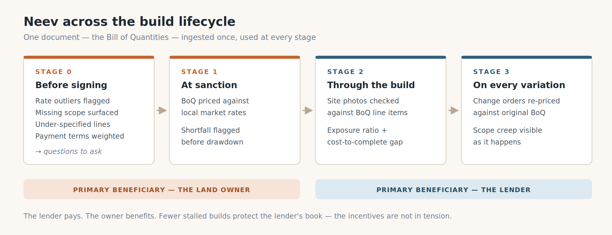
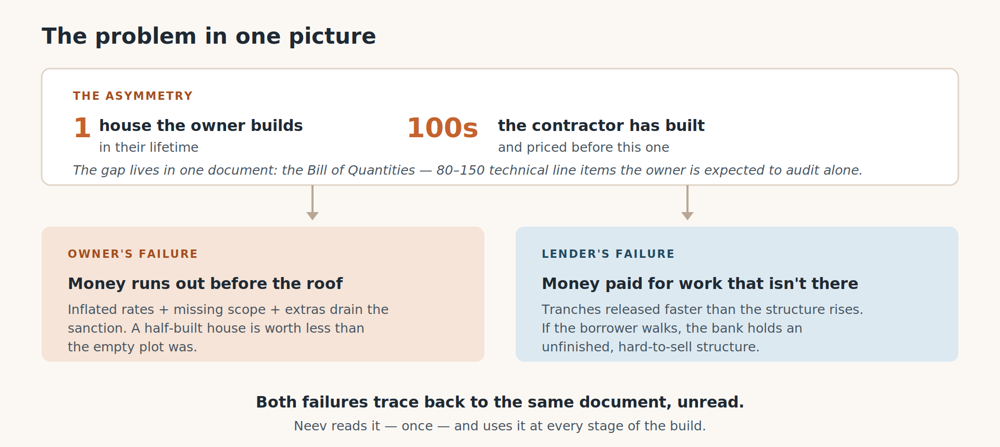
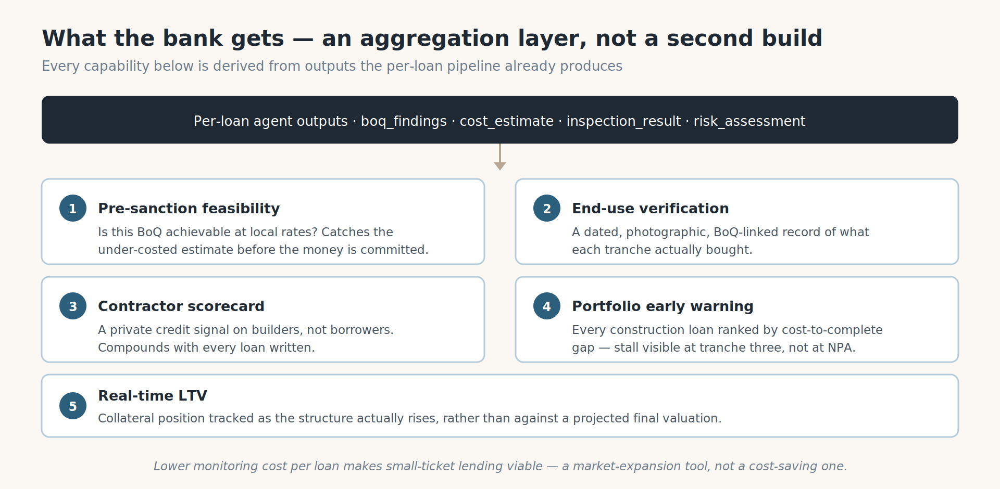
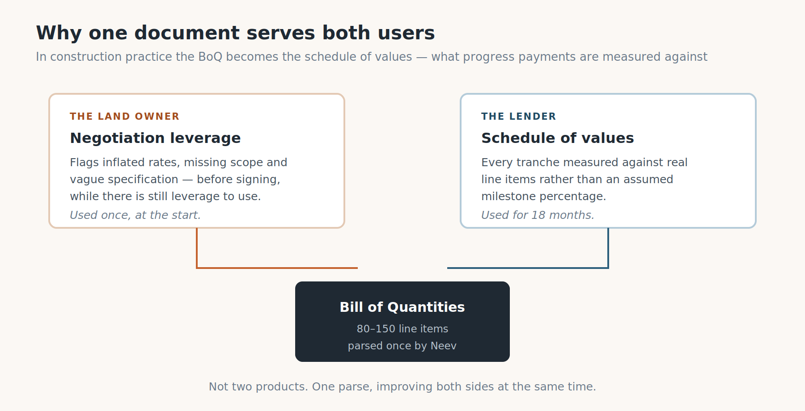

# Neev (नींव)

**Your contractor has priced four hundred houses. You're pricing one.**

> **Neev** is pronounced **"neev"** — one syllable, like *leave* with an n.
> Written नींव in Hindi, it's the word for the foundation of a building: the
> first thing that gets built, and the first thing anyone checks before building
> on top of it. That's the whole intention behind the name — this is the thing
> you look at before you commit.

Neev reads the Bill of Quantities sitting at the centre of a self-construction
home loan, flags what's inflated, missing or vaguely worded — and then keeps
checking that same contract against what's actually been built, at every
disbursement, until the house is finished. It has two faces: one for the family
building the house, one for the credit officer funding it. Both looking at the
same numbers.

| | |
|---|---|
| **Live app** | https://neev-web-516665930454.asia-south1.run.app |
| **Sign in** | `ravi` (flagged contract) · `prasad` (clean) · `officer` (whole book) — password `password` |
| **Repository** | https://github.com/vaishnavigurram6-ui/neev |
| **Built on** | Google ADK · Gemini 3.7 Flash on Vertex AI · Cloud Run · BigQuery |

> **Turning this into the Q7 Google Doc.** Make the Doc **in whichever account
> you're submitting from**, paste this in, then add the figures by hand —
> Google's HTML importer won't fetch remote images. Sections 1, 2 and 3 are the
> three the form asks for, named the way it names them, and
> `figures/fig3_pipeline.png` in §3 is the architecture diagram it specifically
> wants. Last step: set sharing to "anyone with the link → Viewer" and open it
> in a private window to check.

---

# 1. Project description

## What it does

Neev reads a contractor's Bill of Quantities — the line-item contract behind a
self-construction home loan — and checks every line against what that item
actually costs in that locality. It flags rates that are inflated, scope that's
missing, specs too vague to hold anyone to, and payment schedules front-loaded
before there's anything built.

Then it keeps checking the same contract for the rest of the build. A
construction loan doesn't come out in one go; it comes out in tranches against
milestones, and each milestone is a moment where somebody says "this stage is
done, release the money." So the document gets read again at every one of them,
against photographs of what's actually standing on site.

Two people use it, over the same numbers: the family building the house, and the
credit officer funding it.



*Four checkpoints on one contract, from signing through to finishing.*

| Checkpoint | The question actually being answered |
|---|---|
| **Before signing** | What in here is inflated, missing, or vague enough to become an argument later? |
| **At sanction** | Will the approved amount actually finish this house at local rates? Not "does the budget add up", but "does this end with a roof"? |
| **Through the build** | Do the photos from site show the stage being claimed for payment? Answered while the stage is still happening, not in a report afterwards. |
| **On every change** | What's this extra worth, against the line that was signed? |

## Why anyone needs this

Picture a kitchen table on a weekday evening. A family with a plot — maybe
inherited, maybe on the edge of a city that's been growing out toward it for
twenty years. A sanction letter that took months to get. And a document the
contractor dropped off: eighty lines, sometimes a hundred and fifty, every job
in the build with a quantity and a rate beside it.

Somebody signs it tonight. The contractor's waiting.

That paper isn't paperwork — it's *the contract*. It decides what "branded
fittings" turns out to mean six months from now, what's included and what gets
billed later as an extra, and when there's an argument in month seven, it's the
only thing anyone can point at. And the person signing it will build exactly one
house in their life. The person who wrote it has built hundreds.



*One house against four hundred — and the gap lives in a single document.*

That's not a story about crooked builders, which is where everyone's mind goes
first. Think about your first ever hand of cards against someone who's played
four hundred: they're not cheating, they just know which way things tend to go.

Steel is the example that convinced me it's real. Overcharging on steel usually
isn't the rate — it's the **grade**. Fe 415, Fe 500, Fe 500D; stronger steel
means a properly designed structure needs fewer kilos to do the same job. So a
line that just says "TMT bars," with no grade written down, has quietly left the
door open: weaker stuff, more of it, at a rate that looks completely fine. And
it *does* look fine. The owner checks the rate, decides it's about right, and
they're correct — the rate was never where the money was going.

## Why the advice already out there can't reach them

There's no shortage of help: red-flag checklists, line-by-line walkthroughs,
spreadsheet templates, and thousands of reels and videos made by people who
genuinely know construction. It fails in two different ways.

The **written** material assumes you'll work through a hundred-odd technical
lines, checking each rate against local benchmarks you don't have, and spotting
the things that *aren't* there — much harder than spotting something wrong,
because a missing item has nothing on the page for your eye to snag on. You
can't skim for an absence.

The **videos** don't fail when you watch them. They fail months later. You watch
a reel about terrace waterproofing in February; the decision turns up on site in
September with a mason asking whether you want it done now, and you can't
remember whether it said two coats or three.

So the knowledge exists, in enormous quantity. It just can't reach the person who
needs it, in the shape they need it, at the moment they need it.

## The one rule the whole thing follows

> **Every number has to come from somewhere you can check. And where there's
> nothing to check, the system says nothing.**

An item with no benchmark gets withheld, not estimated. A photo the inspector
can't read produces no measurement — and therefore no number that depends on a
measurement. Data that's still provisional says so, on the screen, where you can
see it.

That's not modesty for its own sake. It's the whole difference between something
a credit officer can use and something they can't. A confident wrong number in a
lending decision is worse than a blank space, because somebody will act on it.

Honestly, the hardest part of building this wasn't getting five agents to talk.
It was getting them to stop.

# 2. Project use case

Two people use Neev, at different moments, over the same document. Here's how it
actually goes on the deployed app — you can follow along and check every number.

## 2.1 The borrower — Ravi Kumar, Plot 47, Kompally

**Sign in as `ravi`.**

**Before he signs.** Ravi uploads his contractor's quote: 40 line items,
₹28,47,930. Five agents run over it in about two minutes. What comes back isn't
a score — it's a list of specific things, each with the number it was measured
against:

- **14 flags** — 3 rate outliers, 3 bits of missing scope, 6 vague specs
- The RCC line quoted at **₹9,800/cum** where the Kompally benchmark is
  **₹8,036** — 22% over, with both numbers shown so he can argue about either
- **₹1,42,654 of scope that simply isn't in the document** — external plaster
  and terrace waterproofing
- **45% of the money due before the slab** — ₹12,81,568 before there's anything
  meaningful standing on the plot
- **14 items withheld**, because no benchmark exists for them and a guess would
  be worse than a gap

Then the bit that matters: *Before you sign* hands him plain-language text he can
send his contractor **himself**. Neev doesn't message anyone on his behalf. The
point is that *he* negotiates, from a position of knowing.

**At sanction.** His sanction is ₹28,00,000 against a quote of ₹28,47,930 — and
re-pricing at benchmark rates puts the real cost higher still. So "will this
finish the house?" gets a number instead of a reassurance.

**Through the build.** At each milestone he photographs the site and reports it.
The visual inspector reads the frames and works out which stage they actually
show. And where it can't tell, it says so and escalates to a human rather than
guessing.

**On every change.** When the contractor proposes a kitchen platform upgrade,
it's priced against the line that was signed — granite at ₹18,850 against quartz
at ₹35,100. Ravi can counter with a number.

## 2.2 The credit officer — the whole book

**Sign in as `officer`.**

**The portfolio.** Ten loans, sorted by exposure, worst first. Exposure is
disbursed ÷ verified value in place, so anything above 1 means money's gone out
ahead of what's standing on site.

| Loan | Exposure | What the screen says |
|---|---|---|
| 1004 | 1.71 | ESCALATE — the inspector disagreed with the stage claimed |
| 1009 | 1.13 | ESCALATE — reached on its own, nobody prompted it |
| 1001 | 1.11 | The golden case: flagged contract, slab stage |
| 1003 | 0.87 | Within tolerance |

**One loan.** Drill into 1001 and you get the disbursement schedule: every
tranche, the milestone it pays for, what it releases, where it stands.

**One decision.** Open the tranche that's waiting on an answer and the screen
carries the borrower's site photographs right beside the milestone claimed, the
exposure arithmetic, the cost-to-complete gap, and a recommendation — RELEASE,
HOLD or ESCALATE — with the reasons that produced it.



*The book ranked by exposure, and the evidence behind each release decision.*

An officer can also create their own borrower account at `/signup` and take a
contract through from an empty state, if they want to see the whole loop.

## 2.3 Why both sides, over one document

The arguments this is meant to head off are arguments about **what was agreed**.
So it's not enough for the family to have a good reading of the contract, and it
isn't enough for the lender to have one either. They both need to be looking at
the same reading.



*The same BoQ, read once, used by both sides.*

The family sees their contract gone through line by line, plus a note they can
send. The lender sees the same findings, plus their whole book sorted by
exposure, plus the site photos sitting next to the claim. One document, one set
of numbers, and a specific conversation instead of a vague one.

## 2.4 And what happens if nobody reads it

Nothing bad happens at signing. That's what makes this so easy to skip. It shows
up months later, when there's nothing to be done.

**For the family**, the money runs out before the house is liveable — and that's
worse than it sounds, because a half-built structure is worth *less* than the
empty plot was. Clearing it costs money. By then there's no leverage left,
nothing to renegotiate with, and they're still paying rent somewhere else.

**For the lender**, money's gone out against work that isn't there, or against a
budget that was never going to reach a roof. If the borrower walks away, what's
left as security is an unfinished building.

Both trace back to the same document nobody read. And this isn't a rare edge
case — self-construction is a big slice of affordable-housing lending in India.

---

# 3. Architecture diagram


*Five agents in sequence. Each one writes an `output_key`; the next one reads it.*

## 3.1 Five agents, and state that only moves one way

It's a Google ADK `SequentialAgent`. Each agent writes one `output_key` into
shared session state and the next one reads it — which means the explainer at the
end can only talk about numbers the four before it actually produced. It can't
invent one, because it never sees anything else.

```
BoQ pdf + site photos + loan context
   |
   v
boq_analyst        flags: RATE_OUTLIER, MISSING_SCOPE, UNDERSPECIFIED,
   |               FRONT_LOADED, GST_SILENT
   |  output_key:  boq_analysis
   v
cost_estimation    expected cost, completed-value estimate, sanction gap
   |  output_key:  cost_estimate
   v
visual_inspector   observed stage, banded confidence, needs_human_review
   |  output_key:  inspection
   v
disbursal_risk     exposure ratio, cost-to-complete gap,
   |               RELEASE / HOLD / ESCALATE
   |  output_key:  risk_assessment
   v
explainer          owner_view + officer_view
      output_key:  explanation
```

| Agent | Its job | What grounds it |
|---|---|---|
| `boq_analyst` | Prices every line; raises the five flag types | BigQuery benchmark lookups, adjusted for locality |
| `cost_estimation` | Prices the scope that's absent; the gap against sanction | BigQuery metro price table, then arithmetic |
| `visual_inspector` | Which construction stage the photographs show | Gemini vision, zero-shot, banded confidence |
| `disbursal_risk` | Exposure ratio, cost to complete, the verdict | Pure arithmetic — no model call produces any figure |
| `explainer` | The same finding, written twice for two readers | Only what the four above produced |

Every model call carries retry options — six attempts, exponential backoff with
jitter. That's not belt-and-braces: one run is five-plus calls, and a 3%
per-call failure rate compounds rather than averages.

## 3.2 How that "says nothing" rule is actually enforced

This is the part I'd point at if you only had a minute. The restraint isn't a
line in a prompt asking the model to be careful — it's structural.

- `pipeline_parse.py` raises `Unassessable` when the inspector comes back with
  `matches_claim: null`. A null isn't a "no".
- Cost-to-complete only gets written when something was actually measured. We
  shipped a bug where a fully-disbursed loan displayed a **₹35,95,327 shortfall
  nobody had measured**, because an absent measurement defaulted to zero instead
  of propagating as absent. The fix was to make absence a value that flows
  through.
- `OBSERVABLE_STAGES` gates the evidence: a stage outside it yields no
  measurement, and therefore no figure derived from one.
- Unbenchmarked line items are withheld from the flag list rather than shown as
  clean — so "unflagged" never quietly means "unchecked".

## 3.3 How it's deployed

```
                    browser
                       |  HTTPS
                       v
        +--------------------------------+
        |  neev-web   (Cloud Run)        |  Next.js 16 standalone,
        |  min-instances 0               |  server components + actions
        +--------------------------------+
                       |  server-to-server, private
                       |  NEEV_API_BASE never reaches the browser,
                       |  so there's no CORS configuration at all
                       v
        +--------------------------------+
        |  neev-api   (Cloud Run)        |  FastAPI + SQLAlchemy + SQLite,
        |  min-instances 1, max 1        |  23 API paths
        +--------------------------------+
             |                      |
             v                      v
        Vertex AI              BigQuery
        gemini-3.7-flash       dataset: buildguard_data
        5 agents via ADK       rate_benchmarks, metro_city_prices,
                               loan_history, draw_schedule,
                               portfolio_hotlist (view)
```

Region `asia-south1`. `max-instances 1` looks like a cost setting but it's
actually a correctness one: SQLite lives on the instance's own disk, so a second
instance would be a second database. The runtime service account holds
`aiplatform.user`, `bigquery.jobUser` and `bigquery.dataViewer`, and nothing
else.

The deployment talks to **Vertex AI** as that service account rather than using
an API key, and that's a cost decision. AI Studio's free tier allows 20
`generateContent` requests a day per model — about two analyses — whereas Vertex
bills the project's billing account, which is where the credits are. Three
environment variables, no code change.

## 3.4 Where the data comes from

| Table | Size | Origin | Feeds |
|---|---|---|---|
| `metro_city_prices` | 32,963 listings · 6 metros · 1,776 localities | Kaggle | `cost_estimation` |
| `rate_benchmarks` | 30 items | CPWD DSR 2023-derived, Hyderabad-factored — still marked provisional in the data, and on screen | `boq_analyst` |
| `loan_history` | LTV → default-rate bands | Kaggle Loan_Default, 148,670 mortgages. Used **only** as a lookup prior, never trained on — the dataset has fatal target leakage | `disbursal_risk` |
| `draw_schedule` | 40 tranches · 10 loans | Synthetic. There's no public dataset of bank disbursement ladders anywhere | `disbursal_risk` |

## 3.5 Recorded runs, and the guardrails around them

Two things worth naming, because both are the kind of claim a reader should be
able to check rather than take on trust.

**The ten seeded loans are real recorded runs, not mockups.** There's one
interface, `PipelineRunner`, with a live runner that calls Vertex and a fixture
runner that replays a capture; `NEEV_MODE` picks, and it's read in exactly one
place, with a test that fails if a second reader appears. The captures went
through `scripts/record_golden_run.py` and are validated against the same
schemas a live run has to emit — which is what stops a recording and a live run
from drifting apart. The raw ADK session state for each is committed, saved
*before* parsing.

**And nothing in the test suite can spend money.** An autouse fixture blocks
outbound sockets, and 60 of the tests run with no credentials at all. Live mode
needs two separate switches — `NEEV_MODE=live` *and*
`NEEV_ALLOW_BILLED_CALLS=1` — and an unrecognised mode falls back to fixture
rather than guessing. On the deployed service, per-loan and per-day analysis
caps are enforced server-side, because the URL is public. And authorization is
injected per loan, so one borrower reading another's contract gets a 403 and
only an officer can read the whole book.

**338 automated tests** — 265 backend, 60 offline, 13 frontend — plus typecheck,
lint and a production build. Both container images were built and run as a pair
locally before either was deployed.

## 3.6 What it costs to run

Every figure here is measured from this project, not estimated.

| What | Cost | Notes |
|---|---|---|
| One full BoQ analysis | **₹3.81** | Five agents, ~342k input tokens, about two minutes |
| One milestone check | **₹1.50** | Two agents, about 35 seconds |
| Warm backend, 14 days | **₹740** | `--min-instances 1` at 1 vCPU / 2 GiB, free tier applied |
| Frontend | **~₹0** | `--min-instances 0`; a Next standalone server boots in a second or two |
| BigQuery | **₹0** | The benchmark tables are kilobytes — well inside the free tier |
| One deploy | **₹1–3** | Cloud Build machine-minutes. There's no per-deploy charge |

A full analysis used to cost **₹26.08**. Most of that was a BigQuery pattern
that billed the 10 MB minimum per lookup rather than the data it read; batching
the benchmark queries took it to ₹3.81 — 85% less — and that is the version
running now.

The standing cost is the interesting one. `--min-instances 1` looks extravagant
for a demo, but Cloud Run bills an idle minimum instance on a different SKU from
an active one — ₹0.000238862 per vCPU-second against ₹0.00229308, roughly ten
times less. Two weeks of a warm backend is about ₹740. With the ADK pipeline in
the image, a cold start costs 15–30 seconds of blank screen, so ₹740 buys a
judge not watching a spinner.

The caps put a ceiling on the worst case: 12 analyses per loan per day and 60
across the service, so the most the deployed app can spend on agents in a day is
about **₹229**. That matters because the service is
`--allow-unauthenticated` — the caps are the only thing between a crawler and
the billing account.

There's no upkeep cost beyond that, and it's worth saying why: **nothing here is
trained.** No fine-tuning, no embeddings to refresh, no model to retrain as
rates move. The benchmarks are a BigQuery table, so keeping the pricing current
is a CSV reload, not a training run — which is also what makes it plausible to
extend to a second city.

---

# 4. The stack

| Layer | What |
|---|---|
| Agents | Google ADK `SequentialAgent`, five agents sharing state via `output_key`; `gemini-3.7-flash` on Vertex AI |
| Grounding | Plain Python tools — BigQuery benchmark lookups and pure-arithmetic risk math |
| Backend | Python 3.11, FastAPI, SQLAlchemy, SQLite — 23 API paths |
| Frontend | Next.js 16 App Router, server components and actions, Tailwind v4 — 17 routes |
| Auth | Username and password. The provisioned accounts share one password from the environment; self-created accounts use `hashlib.scrypt`. Sign-up makes borrowers only — officer access to the whole book is never self-served |
| Google Cloud | Vertex AI, Cloud Run, Cloud Build, Artifact Registry, BigQuery, Secret Manager, IAM |

---

# 5. Where it stands, and what would take it further

Four things aren't finished. Each one has a specific next step rather than a
vague intention, and none of them is load-bearing for what the app does today.

- **The benchmark rates need verifying.** They're CPWD DSR 2023-derived and
  Hyderabad-factored, which is a defensible starting point but not an audited
  one — and the `verified` column in the data says so, as do the screens. The
  work is a line-by-line check against the published DSR, and it's a
  spreadsheet afternoon rather than an engineering problem. Nothing else has to
  change: the benchmarks are a BigQuery table, so better numbers are a reload.
- **Durability is one connection string away.** SQLite on the instance disk is
  what makes the demo reproducible — every visitor opens the same ten loans —
  but it means what a visitor creates lives as long as the instance. Pointing
  `DATABASE_URL` at Cloud SQL fixes it, and because everything goes through the
  ORM, not one query would have to move.
- **Identity is a username and a password.** Fine for a demo, not for money.
  Every screen already reads who it's talking to from a single endpoint, so an
  actual provider drops in behind that seam without a screen changing.
- **It's English only for now.** The interface says "coming" for Hindi, Telugu
  and read-aloud rather than pretending otherwise — which matters more than
  usual here, because the people this is for are not, mostly, reading their
  contract in English. That's the first thing worth building next.

## What's actually there

A borrower can upload a contractor's quote and get it read line by line against
local rates, with every flag naming the number it was measured against, and a
note they can send the contractor themselves. A credit officer can open their
whole book ranked by exposure, and for any disbursement see the site
photographs beside the milestone that was claimed, the arithmetic, and a
recommendation with its reasons. Both of them are reading the same document.

That's running now, on live agents, at
[neev-web-516665930454.asia-south1.run.app](https://neev-web-516665930454.asia-south1.run.app)
— and every number on this page can be checked against it.

*Neev — नींव. The first thing that gets built, and the first thing worth
checking.*
