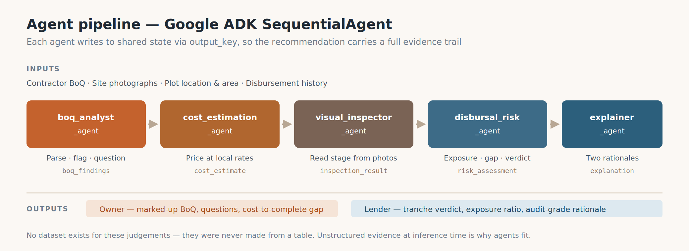

# Neev (नींव)

**Your contractor has priced four hundred houses. You're pricing one.**

> **Neev** is pronounced **"neev"** — one syllable, like *leave* with an n.
> It's नींव in Hindi, the word for a building's foundation: the first thing
> built, and the first thing anyone checks before building on top of it.

| | |
|---|---|
| **What it is** | A two-sided web app over five Google ADK agents. It reads the Bill of Quantities behind a self-construction home loan, flags what's inflated, missing or vaguely worded, and keeps checking that same contract against site photographs at every disbursement. |
| **Who uses it** | The family building the house, and the credit officer funding it — over one set of numbers. |
| **Live app** | https://neev-web-516665930454.asia-south1.run.app |
| **Sign in** | `ravi` (flagged contract) · `prasad` (clean) · `officer` (whole book) — password `password` |
| **Stack** | Google ADK · Gemini 3.7 Flash on Vertex AI · Cloud Run · BigQuery · FastAPI · Next.js 16 |
| **Repository** | https://github.com/vaishnavigurram6-ui/neev |
| **Proven** | One live run on the deployed service: 40 line items, **14 flags**, 200 seconds. 338 automated tests. |
| **Costs** | **₹3.81** a full analysis · **₹1.50** a milestone check · **₹740** a fortnight of warm infrastructure |

> **For the Q7 Google Doc:** make the Doc in the account you're submitting from,
> paste this in, insert the three figures by hand (Google's importer won't fetch
> them), then share → *anyone with the link → Viewer*. Sections 1, 2 and 3 are
> the three the form asks for, under its own names.

---

# 1. Project description

A family has a plot, a sanction letter, and a document the contractor dropped
off: a Bill of Quantities, eighty to a hundred and fifty lines, every job in the
build with a quantity and a rate. Somebody signs it after one evening of looking
at it.

That document isn't paperwork — it's the contract. It decides what "branded
fittings" turns out to mean, what's in scope and what gets billed later as an
extra, and it's the only thing anyone can point at when there's an argument in
month seven. The person signing it will build **one house in their life**. The
person who wrote it has built hundreds.

**It isn't a story about dishonesty.** A contractor who's priced four hundred
houses knows what RCC costs in that locality this year, which items get left out
and argued about later, and how much to ask for before the slab is cast. Steel
is the clearest case: overcharging usually isn't the rate, it's the **grade**.
Fe 415, Fe 500, Fe 500D — stronger steel means fewer kilos for the same
structure, so a line reading "TMT bars" with no grade named leaves room for a
weaker grade in a higher quantity at a rate that looks entirely normal. The
owner checks the rate, finds it reasonable, and is right. The rate was never the
problem.

Plenty of guidance exists — checklists, walkthroughs, thousands of reels. It
assumes someone will audit a hundred technical lines against benchmarks they
don't have, hunting for scope that's *absent*, which is harder than finding
scope that's wrong. So Neev reads the document instead, and keeps reading it:
a construction loan is disbursed in tranches against milestones, and each one is
a moment where somebody claims a stage is done.

| Checkpoint | The question answered |
|---|---|
| **Before signing** | What's inflated, missing, or vague enough to be argued about later? |
| **At sanction** | Will the approved amount finish this house at local rates — does this end with a roof? |
| **Through the build** | Do the site photographs show the stage being claimed? Answered while the stage is happening, not in a report afterwards. |
| **On every change** | What's this extra worth against the line that was signed? |

## The one rule the whole build follows

> **Every number comes from somewhere checkable, and where there's nothing to
> check, the system says nothing.**

An item with no benchmark is withheld, not estimated. A photograph the inspector
can't read produces no measurement, and therefore no figure derived from one.
Provisional data says so on screen. That's the difference between a tool a
credit officer can use and one they can't: a confident wrong number in a lending
decision is worse than a blank, because somebody acts on it.

---

# 2. Project use case

## The borrower — Ravi Kumar, Plot 47, Kompally

Signed in as `ravi`, he uploads his contractor's quote: 40 line items,
₹28,47,930. Five agents run in about two minutes. **These are the figures the
deployed service actually produced** — every one is checkable on the live app:

| Finding | |
|---|---|
| 14 flags | 3 rate outliers · 3 missing scope · 6 vague specifications |
| RCC at ₹9,800/cum | against a ₹8,036 Kompally benchmark — **22% over**, with both numbers shown |
| ₹1,42,654 absent | external plaster and terrace waterproofing aren't in the document at all |
| 45% due before the slab | ₹12,81,568 before there's meaningful structure |
| 14 items withheld | no benchmark exists, and a guess would be worse than a gap |

Then the part that matters: *Before you sign* gives him plain-language text he
sends his contractor **himself**. Neev messages nobody on his behalf — the point
is that he negotiates from a position of knowing.

Through the build he photographs each milestone; the inspector reads the frames
and decides which stage they show, escalating to a human where it can't tell.
When the contractor proposes a kitchen platform upgrade, it's priced against the
signed line — granite at ₹18,850 against quartz at ₹35,100.

## The credit officer — the whole book

Signed in as `officer`: ten loans ranked by exposure, worst first. Exposure is
disbursed ÷ verified value in place, so above 1 means money went out ahead of
what's standing on site.

| Loan | Exposure | Verdict |
|---|---|---|
| 1004 | 1.71 | ESCALATE — the inspector disagreed with the stage claimed |
| 1009 | 1.13 | ESCALATE — reached unprompted |
| 1001 | 1.11 | The golden case: flagged contract, slab stage |

Opening a tranche gives the decision screen: the borrower's photographs beside
the milestone claimed, the exposure arithmetic, the cost-to-complete gap, and
RELEASE / HOLD / ESCALATE with the reasons that produced it.

**Why both sides, over one document.** The disputes this prevents are disputes
about *what was agreed* — so it isn't enough for the borrower to have a good
reading of the contract, or the lender to have one. They have to be reading the
same one.

---

# 3. Architecture diagram



*Five agents in sequence. Each writes one `output_key`; the next reads it.*

```
BoQ pdf + site photos + loan context
   |
   v
boq_analyst        flags: RATE_OUTLIER, MISSING_SCOPE, UNDERSPECIFIED,
   |               FRONT_LOADED, GST_SILENT          -> boq_analysis
   v
cost_estimation    expected cost, completed value, sanction gap
   |                                                 -> cost_estimate
   v
visual_inspector   observed stage, banded confidence, needs_human_review
   |                                                 -> inspection
   v
disbursal_risk     exposure ratio, cost-to-complete gap,
   |               RELEASE / HOLD / ESCALATE          -> risk_assessment
   v
explainer          owner_view + officer_view          -> explanation
```

A Google ADK `SequentialAgent`. Because each agent only sees what the ones
before it wrote, the explainer can't invent a number — it never sees anything
but upstream state. Every model call carries six retry attempts with
exponential backoff, since one run is five-plus calls and a 3% per-call failure
rate compounds rather than averages.

**Grounding.** `boq_analyst` and `cost_estimation` price against BigQuery
benchmark lookups; `disbursal_risk` is pure arithmetic — no model call produces
any figure. `visual_inspector` is Gemini vision, zero-shot, with banded
confidence.

## How the "says nothing" rule is enforced

Structurally, not as a prompt instruction:

- `pipeline_parse.py` raises `Unassessable` when the inspector returns
  `matches_claim: null`. A null isn't a "no".
- Cost-to-complete is written only when something was measured. A
  fully-disbursed loan once displayed a **₹35,95,327 shortfall nobody had
  measured**, because an absent measurement defaulted to zero instead of
  propagating as absent. The fix made absence a value that flows.
- Unbenchmarked items are withheld from the flag list rather than shown clean,
  so "unflagged" never quietly means "unchecked".

## Deployment

```
browser --HTTPS--> neev-web (Cloud Run, Next.js 16, min-instances 0)
                      |
                      |  server-to-server, private. NEEV_API_BASE never
                      |  reaches the browser, so there is no CORS config
                      v
                   neev-api (Cloud Run, FastAPI + SQLite, min 1 / max 1)
                      |                         |
                      v                         v
                 Vertex AI                  BigQuery
                 gemini-3.7-flash           buildguard_data:
                 5 agents via ADK           rate_benchmarks, metro_city_prices,
                                            loan_history, draw_schedule
```

Region `asia-south1`. `max-instances 1` is a correctness requirement, not a cost
one: SQLite lives on the instance disk, so a second instance would be a second
database. The service account holds `aiplatform.user`, `bigquery.jobUser` and
`bigquery.dataViewer`, nothing more. It authenticates to **Vertex AI** rather
than using an API key because AI Studio's free tier allows 20 requests a day per
model — about two analyses — while Vertex bills the project account.

## Data, and what it cost

| Table | Origin |
|---|---|
| `metro_city_prices` | Kaggle — 32,963 listings, 6 metros, 1,776 localities |
| `rate_benchmarks` | CPWD DSR 2023-derived, Hyderabad-factored. Marked provisional in the data, and on screen |
| `loan_history` | Kaggle Loan_Default, 148,670 mortgages — used **only** as an LTV lookup prior, never trained on: the dataset has fatal target leakage |
| `draw_schedule` | Synthetic. No public dataset of bank disbursement ladders exists |

| Cost | |
|---|---|
| One full analysis | **₹3.81** — down from ₹26.08, once the benchmark lookups were batched instead of each billing BigQuery's 10 MB minimum |
| One milestone check | **₹1.50** |
| Warm backend, 14 days | **₹740** — an idle min-instance bills a different SKU from an active one, ~10× less |
| Worst case per day | **~₹229** — capped at 12 analyses per loan and 60 per service, which on an `--allow-unauthenticated` URL is the only thing between a crawler and the billing account |

**No upkeep beyond that, because nothing is trained.** No fine-tuning, no
embeddings, no retraining as rates move — keeping the pricing current is a CSV
reload, which is what makes a second city plausible.

## What you can check

The ten seeded loans are **real recorded runs**, not mockups: captured through
`scripts/record_golden_run.py` and validated against the same schemas a live run
must emit, which is what stops a recording and a live run from drifting apart.
And nothing in the suite can spend money — an autouse fixture blocks outbound
sockets, live mode needs two separate switches, and authorization is injected
per loan, so one borrower reading another's contract gets a 403.

**338 automated tests** — 265 backend, 60 offline, 13 frontend — plus typecheck,
lint and a production build. Both container images were built and run as a pair
locally before either was deployed.

---

# 4. Where it stands

Four things aren't finished. None is load-bearing for what the app does today,
and each has a specific next step.

| Today | What would close it |
|---|---|
| Benchmark rates are CPWD-derived but not audited line by line — the data says so, and so do the screens | A line-by-line check against the published DSR. The benchmarks are a BigQuery table, so better numbers are a reload |
| SQLite on the instance disk makes the demo reproducible, but what a visitor creates lives as long as the instance | Point `DATABASE_URL` at Cloud SQL. Everything goes through the ORM, so not one query moves |
| Sign-in is a username and password, not a verified identity | Every screen already reads its identity from one endpoint; a real provider drops in behind it |
| English only — the interface says "coming" for Hindi and Telugu rather than pretending | The first thing worth building next, given who this is for |

**What's there today:** a borrower uploads a contractor's quote and gets it read
line by line against local rates, with every flag naming the number it was
measured against and a note they can send themselves. A credit officer opens
their whole book ranked by exposure and, for any disbursement, sees the site
photographs beside the milestone claimed, the arithmetic, and a recommendation
with its reasons. Both are reading the same document.

That's running now, on live agents, at
[neev-web-516665930454.asia-south1.run.app](https://neev-web-516665930454.asia-south1.run.app)
— and every number above can be checked against it.
